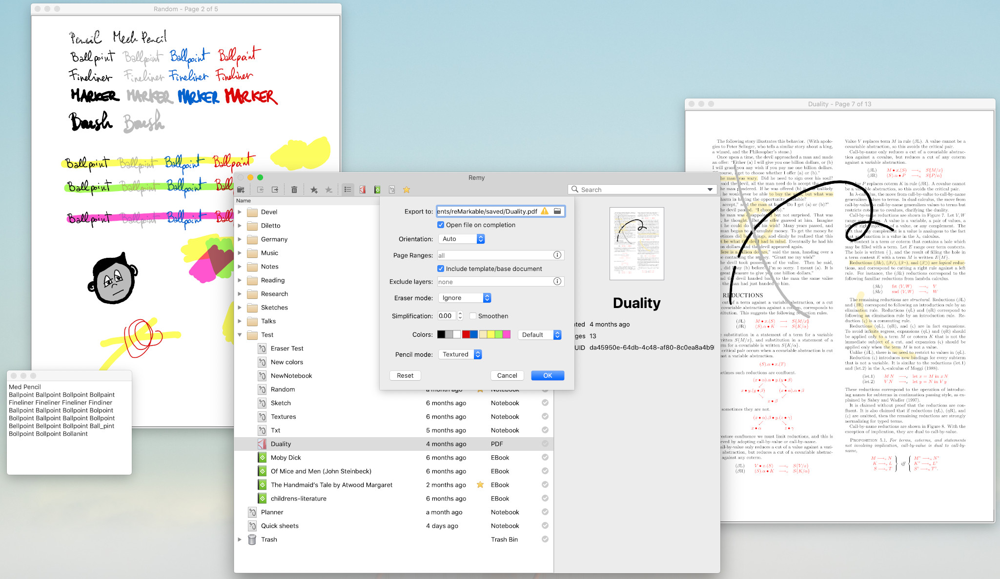

# Remy, a reMarkable tablet manager app

The goal of Remy is to allow simple interaction with the reMarkable tablet over ssh, without needing the cloud service, nor the USB Web UI.




**BEWARE**

This is a work-in-progress with incomplete features.
It has not been thoroughly tested.
These instructions are preliminary and will be expanded with time.
Feel free to populate the wiki!

I did my best to make sure usage of Remy will not incur in data loss.
Most of the features exclusively read from the tablet and are completely safe, even if they may fail on the computer side.
The only features that alters data on the tablet is the upload feature.
It is however very unlikely to cause any problem since it only adds files.
In any case, it is highly advisable to back up your data before playing with it!

For a basic backup of the tablet's data:

    scp -rp REMARKABLEHOST:/home/root/.local/share/remarkable/xochitl .


## Installation

An installation script and pre-built bundles are in the roadmap but not available yet.

The following installs the dependencies on MacOs (Catalina), assuming `python` version 3.8 (if not, use `pyenv` to install and manage Python versions):

```bash
pip install requests arrow paramiko PyPDF2 PyQt5 PyMuPDF simplification sip
```

The requirements are:

- requests
- sip
- arrow
- paramiko
- PyPDF2
- PyQt5

Only required for previewing PDF files:

- PyMuPDF (or, alternatively, python-poppler-qt5)

Optional:

- simplification (this requires python < 3.9)


## Usage

The main intended usage is as a GUI for connecting to the tablet.
The app however also supports reading from a local backup.
The main entry point for the app is `remygui.py`.

## Configuration

Starting it the fist time with `python remygui.py` will print an error message with the path where the app is expecting to find a configuration file (on macOS it would be something like `/Users/<user>/Library/Preferences/remy.json`).
Create a JSON file at that path with the following structure:

```json
{
  "sources": {
      "source1": {...},
      "source2": {...},
      ...
  },
  "default_source": "source1",
  "palettes" : {...},
  "preview": {...},
  "export": {...},
  "upload": {...},
  "mathpix" : {...}
}
```

The only mandatory section is `sources`.
Each section is documented below.
The file `example_config.json` is an example configuration that you can adapt to your needs.
**IMPORTANT**: the format is vanilla JSON; trailing commas and C-like comments are **not supported**. The file is parsed using Python's standard `json` module.

### Source types
Each source defines a possible way to get the contents to display.
The `default_source` settings indicates which source to load if none is specified in the command line.
If `default_source` is `false` or not set, then Remy shows a dialog allowing you to pick a source among the available ones.
There are three supported kinds of sources: `local`, `ssh` and `rsync`.

#### Local source

A `local` source expects to find the data at a local path (e.g. from a backup folder):
```json
{
  "name": "Latest Backup",
  "type": "local",
  "documents": "/path-to/backup/latest",
  "templates": "/path-to/templates"
}
```
The `documents` folder is expected to have the same structure as the `/home/root/.local/share/remarkable/xochitl` on the tablet.
The "maintenance" folders `.cache`, `.thumbnails`, `.textconversion`, `.highlights` are not needed.
The `templates` folder is expected to be a local copy of the `/usr/share/remarkable/templates` folder on the tablet.
Obviously, this source is read-only: you cannot upload PDFs to it.

#### SSH source

```json
{
  "name": "reMarkable (WiFi)",
  "type": "ssh",
  "host": "192.168.1.154",
  "key": "~/.ssh/id_rsa_remarkable",
  "username": "root",
  "timeout": 3,
  "use_banner": "remy-banner.png",
}
```

The SSH-type source connects to the tabled via SSH.
The tablet needs to be either plugged via USB
(in which case you should set `"host": "10.11.99.1"`)
or via WiFi, in which case you need to find the address assigned to the tablet or you can use the hostname "reMarkable" 
(if your router supports hostname resolution) in the "About" section of the tablet's settings.
Most settings are optional, you can also use `password` instead of `key`.
The option "host" falls back to the USB configuration "10.11.99.1".
The `use_banner` setting is optional and described below.
It is possible to specify `remote_documents` and `remote_templates`, these paths need to be absolute ("~" expansion does not work).

#### Rsync source

```json
{
  "name": "reMarkable (RSync)",
  "type": "rsync",
  "data_dir": "/path-to/remy",
  "host": "10.11.99.1",
  "key": "~/.ssh/id_rsa_remarkable",
  "username": "root",
  "timeout": 3,
  "use_banner": "remy-banner.png",
  "rsync_path": "/path/to/local/rsync",
  "rsync_options": [ "--rsync-path=/opt/bin/rsync" ]
}
```

This is an optimised version of the SSH source.
While SSH works without extra dependencies, the rsync source requires `rsync` to be installed on the reMarkable.
A mandatory setting is `data_dir` which should point to a directory which can be managed by Remy to keep a partial copy of the tablet's data.
Every time you connect, only the changes are downloaded.
The data-heavy files (PDFs and .rm) are downloaded on demand.
The optional settings `rsync_path` provides the path to the local rsync binary and `rsync_options` provides additional options, the example above configures the options to find the rsync binary on the remarkable installed using entware.


#### The `use_banner` option

When this option is set, the main UI of the tabled will be temporarily disabled while Remy is open.
This is intended as an helpful prompt and a way to avoid conflicts on data access.
The feature works best if the setting is the filename (can be absolute, or relative to home) of a png file stored on the tablet (there's a nice `remy-banner.png` in the asset folders you can upload with `scp`) and [`remarkable-splash`](https://github.com/ddvk/remarkable-splash) is installed on the tablet.

If Remy crashes and the remarkable seems unresponsive it is only because Remy re-enables the main UI of the tabled on exit; to regain control of the tablet you have three options: try and run Remy again and close it cleanly; or run `ssh REMARKABLEHOST /bin/systemctl start xochitl`; or manually reboot the device. Don't worry nothing bad is happening to the tablet in this circumstance.

### Palettes section

The `palettes` section is a dictionary of color palettes, for example:

```json
"palettes": {
    "review": {
        "black": "red",
        "gray": "#009C26"
    },
    "grayscale": {
        "black": "black",
        "gray": "#bbbbbb",
        "white": "white",
        "blue": "#cccccc",
        "red": "#dddddd",
        "highlight": "#7fcccccc",
        "yellow": "#7fcccccc",
        "green": "#7fbbbbbb",
        "pink": "#7fdddddd"
    }
}
```

There is always a `'default'` palette with the built-in choice of colors.
You can overwrite it by redefining it in the `palettes` dictionary.
All other palettes inherit the non-specified colors from the built-in defaults.

The palettes defined in the section are used in two ways:

- they are offered as options in the Export dialog
- the defined names can be used as values of the `palette` setting in the `preview` and `export` sections.

The color identifiers are `black`, `gray`, `white`, `blue`, and `red`,
and for the highlighter colors they are `highlight` (for the old opacity-based highlighter) `yellow`, `green`, and `pink`.

Currently it is not possible to change the pencil's color.


### Render options

The `preview` and `export` sections can contain settings that affect the rendering (which we will group in the explanation as `RENDER_OPTIONS`).

All these settings are optional.
The `RENDER_OPTIONS` settings can set the following keys:

- `palette`
  can be set either to the name of a palette defined in the `palettes` section, or to a dictionary with color definitions (as used in the `palettes` dictionary).

- `pencil_resolution`
  can be set to a number indicating how much to scale the texture of pencil brushes. Bigger scale means coarser texture.
  Default is `0.4`.
  Due to limitations of Qt, the PDF export currently ignores this setting.

- `simplify`
  can be set to a number indicating a tolerance for the precision of strokes.
  High tolerance means strokes will be more approximate.
  Requires the `simplification` library.
  Default is `0` (no simplification).
  
- `smoothen`
  can be set to `true` or `false`. Default is `false`.
  If set, the renderer would produce beziers interpolating the original strokes.
  Can be used in combination with `simplify` to obtain smaller files with smooth lines.
  The feature is still experimental.
  
- `eraser_mode`
  can be set to either `"accurate"`, `"ignore"`, `"quick"`, or `"auto"`. Default is `"auto"`.

  * The `"accurate"` method clips the paths so that the erased areas are see-through.
    This incurs in expensive calculations and bigger files.
    It makes a difference only when the eraser is used to carve out precise bits out of wide stroked areas.
  * The `"ignore"` method gives generally the best tradeoff. It simply ignores the eraser strokes.
    The tablet already removes from the file the strokes that were completely covered by eraser strokes.
    The only inaccuracies come from strokes that were only partially covered.
    For written notes or line art this is the best method.
  * The `"quick"` method paints white strokes to render the eraser tool.
    This results in quicker rendering times but inaccurate results:
    the layers below the strokes would be covered by the eraser which is undesirable.
  * `"auto"` will use `"ignore"` and automatically switch to `"accurate"` when the page contains strokes that may need the accurate method to be rendered precisely (e.g. with very wide strokes).
  
  
- `exclude_layers`
  can be set to a list of numbers between 1 and 5 indicating which layers to exclude from the rendering.

- `orientation`
  can be set to `auto`, `landscape` or `portrait`.

- `include_base_layer`
  can be set to `true` or `false`, determining whether the template/pdf/epub layer is to be included or not in the rendering.
  Default is `true`.


### Preview options

The preview section contains `RENDER_OPTIONS` determining how the previewer will render notebooks.

```json
"preview": {
  RENDER_OPTIONS
}
```


### Export options

The export section determines the defaults used for exporting notebooks to PDFs.
In addition to `RENDER_OPTIONS` you can also set the `default_dir` and the `open_exported` settings

```json
"export": {
  "default_dir": "/path/to/folder",
  "open_exported": true,
  RENDER_OPTIONS
}
```

The highlighter colors will be rendered with opacity 50%
since the PDF exporter of Qt5 does not support blend modes.

### Upload options

The upload section determines the defaults used for documents uploaded via Remy.
This section can contain three sub-sections, all optional:

```json
"export": {
  "default_options": UPLOAD_OPTIONS,
  "pdf_options": UPLOAD_OPTIONS,
  "epub_options": UPLOAD_OPTIONS
}
```

Here, `UPLOAD_OPTIONS` is a dictionary which would overwrite the default values stored in the `.contents` metadata files on the tablet.
This includes information about the initial tool settings like selected tool, width for each tool, color for each tool etc.
The available options are whichever ones are supported by the tablet. They are undocumented and so this setting is done through guesswork; making mistakes should not be harmful however.

The options in `pdf_options` and `epub_options` inherit the ones in `default_options`.
Here is an example:

```json
"default_options": {
    "extraMetadata": {
        "LastBallpointv2Color": "Black",
        "LastBallpointv2Size": "2",
        "LastCalligraphyColor": "Black",
        "LastCalligraphySize": "3",
        "LastEraserSize": "1",
        "LastEraserTool": "Eraser",
        "LastFinelinerv2Color": "Black",
        "LastFinelinerv2Size": "1",
        "LastHighlighterv2Color": "HighlighterYellow",
        "LastMarkerv2Color": "White",
        "LastMarkerv2Size": "3",
        "LastPaintbrushv2Color": "Black",
        "LastPaintbrushv2Size": "3",
        "LastPencilv2Color": "Black",
        "LastPencilv2Size": "2",
        "LastSharpPencilv2Color": "Black",
        "LastSharpPencilv2Size": "2",
        "LastPen": "Ballpointv2",
        "LastTool": "Ballpointv2"
    }
},
"pdf_options": {
    "extraMetadata": {
        "LastFinelinerSize": "1",
        "LastPen": "Finelinerv2",
        "LastTool": "Finelinerv2"
    }
},
"epub_options": {
    "extraMetadata": {
        "LastPen": "Highlighterv2",
        "LastTool": "Highlighterv2"
    }
}
```


### Mathpix options

To use the mathpix API you need to obtain personal tokens at https://mathpix.com/ocr (they have a free plan).
Once obtained, the API tokens should be saved in the configuration as follows:

```json
"mathpix" : {
  "app_id":"xxx_xxx_xxx_xxx_xxxxxx",
  "app_key":"xxxxxxxxxxxxxxxxxxxx"
}
```

The support for mathpix is currently experimental.
Only one page at a time can be exported (via context menu in preview) and the data is sent in vector form, which means the eraser tool is ignored.


## Features

Once the configuration file contains the necessary info, you can run Remy by running

    python remygui.py [SOURCE]

The option is the id of one of the sources defined in the configuration file.
With no option, the default source will be selected.

The app displays the tree of the files in the main window and allows to search by name/type.

### Preview

Double clicking on a PDF or notebook will open a preview window.
Use the arrows to got to next/prev page. You can zoom in and out with + and - or mouse wheel. Ctrl+Left/Right rotates the view. The context menu shows some further actions.
Pressing S increases the simplification of the lines, Shift+S decreases it (this is only a rendering effect, the notebooks are unaffected). This is just a preview of an experimental feature.


### Export and rendering

PDFs are rendered in the previewer at a fixed resolution.
The export function overlays the vectorial data from annotations to the original PDF so the quality of both is preserved.

The rendering of notebooks/annotations has been redeveloped from scratch.
Features:

- control over the rendering of eraser (including accurate mode)
- pencil textures
- control over layers to be rendered, colors to be used
- page ranges for export
- optional simplification and smoothening (experimental)

Planned features include:

- fully parametric rendering to be able to control the colors/style of each element from settings
- batch export
- previewer with text recognition, annotations, and rendering options panels
- text search
- raster and SVG export

### Upload

From the tree view, select a folder (or deselect to select the root) and drag and drop on the info panel any PDF (multiple PDFs/EPUBs at once are supported, folders are planned but not supported yet).
Alternatively, choose <kbd>Upload Here...</kbd> from the contextual menu of the destination folder.


- - -

Every source can in addition overwrite other global settings
by using the `settings` key, for example you could have a per-source default export folder:

```json
{
  "sources": {
    "source1": {...},
    "source2": {
      ...
      "settings": {
        "export": {
          "default_dir": "/path-to/love-letters"
        }
      }
     },
    ...
  },
  "export": {
    "default_dir": "/path-to/work"
  }
}
```

## Credits

- Some icons from [ElementaryOs](https://github.com/elementary/icons)
- Some icons adapted from designs by Freepik, xnimrodx from www.flaticon.com
- <a href="https://icons8.com/icon/tj2i6baf72s0/pencil">Pencil spinner by Icons8</a>

## Disclaimer

This project is not affiliated to, nor endorsed by, [reMarkable AS](https://remarkable.com/).
**I assume no responsibility for any damage done to your device due to the use of this software.**

## Licence

GPLv3
